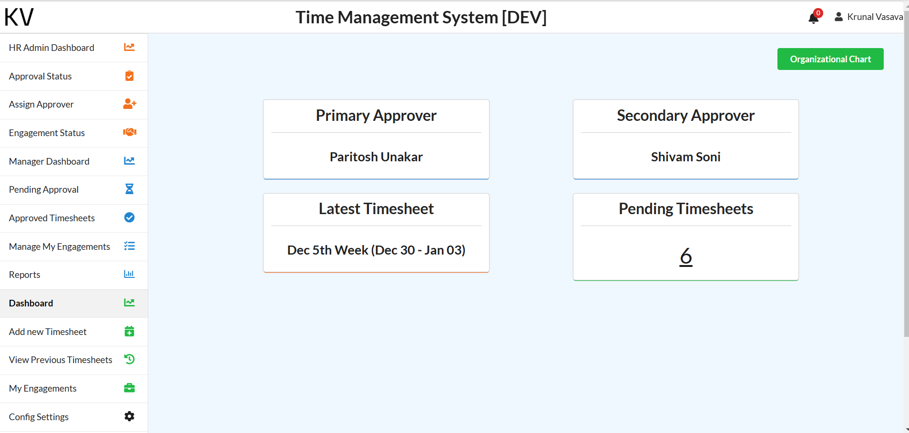
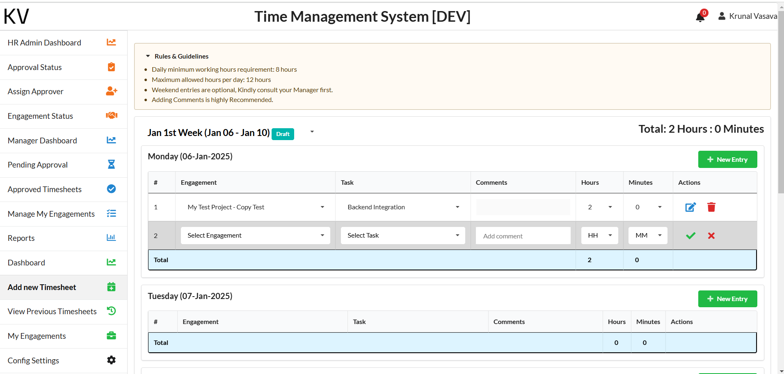
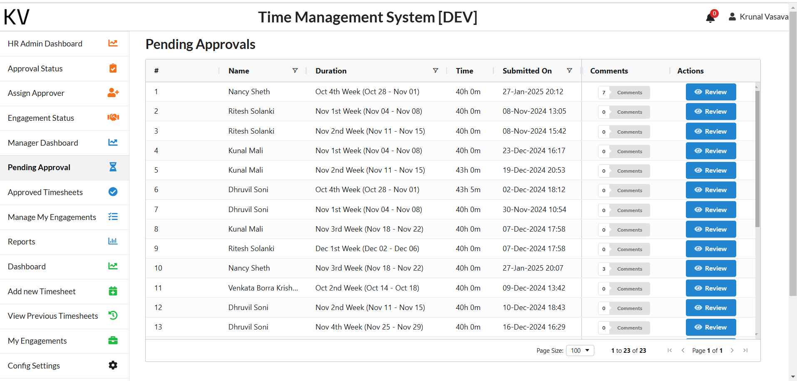
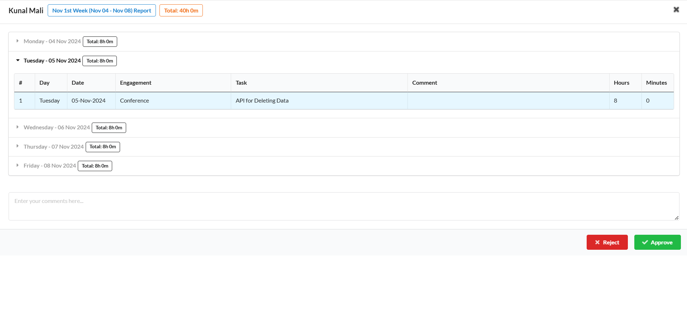

# Full-Stack TimeSheet Management System


## Table of Contents
- [Introduction & Summary](#introduction--summary)
- [Project Images](#project-images)
- [Technical Aspects](#technical-aspects)
- [Tools & Technologies Used](#tools--technologies-used)
- [Installation & Setup Guide](#installation--setup-guide)
- [API Documentation](#api-documentation)


## Introduction & Summary
The Full-Stack TimeSheet Management System is designed to streamline the process of tracking and managing employee timesheets. It offers a comprehensive solution for project managers, HR administrators, and employees to efficiently manage time entries, approvals, and reporting.

### Key Features
- **User Management**: Role-based access for Admins, Managers, and Employees.
- **Timesheet Entries**: Easy-to-use interface for logging work hours.
- **Approval Workflow**: Automated approval process for timesheets.
- **Reporting**: Detailed reports for project and employee time tracking.
- **Notifications**: Email notifications for timesheet submissions and approvals.

### Target Users
- **Project Managers**: Oversee project timelines and team contributions.
- **HR Administrators**: Manage employee timesheets and approvals.
- **Employees**: Log work hours and submit timesheets for approval.

## Project Images






## Technical Aspects
### System Architecture
The system follows a multi-tier architecture:
- **Frontend**: Built with JavaScript, HTML, CSS.
- **Backend**: Powered by .NET Core for robust and scalable server-side logic.
- **Database**: SQL Server for reliable data storage and management.

### Database Structure
The database includes tables for users, roles, timesheets, projects, and notifications. Key relationships are established to ensure data integrity and efficient querying.

### Key Functionalities
- **User Authentication**: Secure login and role-based access control.
- **Timesheet Management**: CRUD operations for timesheets.
- **Approval Workflow**: Multi-level approval process for timesheet submissions.
- **Reporting**: Generate and export detailed reports.

### Workflow
1. **User Login**: Users log in based on their roles.
2. **Timesheet Entry**: Employees log their work hours.
3. **Submission**: Timesheets are submitted for approval.
4. **Approval**: Managers review and approve/reject timesheets.
5. **Reporting**: Admins generate reports for analysis.

## Tools & Technologies Used
- **Frontend**: HTML, CSS, JavaScript, Fomantic UI, Bootstrap
- **Backend**: .NET Core MVC , 3 tier Architecture
- **Database**: MS SQL Server, Stored Procedures, SQL functions, Views
- **APIs**: RESTful APIs
- **Authentication**: Microsoft Authentication
- **DevOps**: Azure Devops
- **Reports**: WebDataRocks

## Installation & Setup Guide
### Prerequisites
- .NET Core SDK
- Node.js
- SQL Server

### Steps
 **Clone the Repository**
   ```sh
   git clone https://github.com/krunalvasava13/Full-Stack-TimeSheet-Management-System.git
   ```

## API Documentation

## Timesheet API Endpoints

### Timesheet Data
- **GET** `/api/timesheet` - Retrieve timesheet data for the logged-in user.
- **GET** `/api/timesheet/{timesheetID}` - Retrieve timesheet lines by TimesheetID.

### Timesheet Management
- **POST** `/api/timesheet/save` - Add or update a timesheet entry.
- **DELETE** `/api/timesheet/{lineID}` - Delete a specific timesheet line.

### Timesheet Approval Process
- **POST** `/api/timesheet/Submit` - Submit a timesheet for approval.
- **POST** `/api/timesheet/Approve` - Approve a submitted timesheet.
- **POST** `/api/timesheet/Reject` - Reject a submitted timesheet.

### Timesheet Status
- **GET** `/api/timesheet/GetPendingTimesheets` - Retrieve pending timesheets for approval.
- **GET** `/api/timesheet/approved` - Retrieve approved timesheets.
- **GET** `/api/timesheet/previous` - Retrieve previous timesheets.

### Timesheet Dropdown Data
- **GET** `/api/timesheet/ddr` - Retrieve dropdown data for adding a new timesheet.

### Timesheet Comments
- **GET** `/api/timesheet/gettimesheetcomments?timesheetId={timesheetId}` - Retrieve comments for a timesheet (Manager view).
- **GET** `/api/timesheet/getvptimesheetcomments?timesheetId={timesheetId}` - Retrieve comments for a timesheet (Employee view).

### Email Notifications
- **GET** `/api/timesheet/sendemail` - Trigger email notification for approval.
- **POST** `/api/timesheet/sendemail` - Manually trigger email notifications.
- **POST** `/api/timesheet/TriggerEmail` - Send approval emails.

### Test Endpoint
- **GET** `/api/timesheet/Test` - Test email sending functionality.

# Engagement API Endpoints

## Engagement Management

### Save an Engagement
**POST** `/api/Engagement/Save`
- Saves a new engagement.

### Get All Engagements
**GET** `/api/Engagement`
- Retrieves all engagements.

### Get Engagement by Owner
**GET** `/api/Engagement/owner`
- Retrieves engagements owned by the current user.

### Get Engagements by User and Date
**GET** `/api/Engagement/GetEngagementsByUserAndDate/{date}`
- Retrieves engagements for a specific user and date.

### Get Engagements for Employee
**GET** `/api/Engagement/myengagements`
- Retrieves engagements assigned to the logged-in employee.

## Task Management

### Get All Tasks
**GET** `/api/Engagement/tasks`
- Retrieves all tasks.

### Get Task by Task ID
**GET** `/api/Engagement/tasks/{id}`
- Retrieves a specific task by its ID.

### Get Tasks by Engagement ID
**GET** `/api/Engagement/{id}`
- Retrieves tasks associated with a specific engagement.

### Add or Update Task
**POST** `/api/Engagement/tasks`
- Adds or updates a task.

### Delete Task
**DELETE** `/api/Engagement/tasks/{id}`
- Soft deletes a task by ID.

## Delete Engagement

### Delete an Engagement
**DELETE** `/api/Engagement/DeleteEngagement/{engagementId}`
- Deletes an engagement by ID.

Made with ❤️ by Krunal